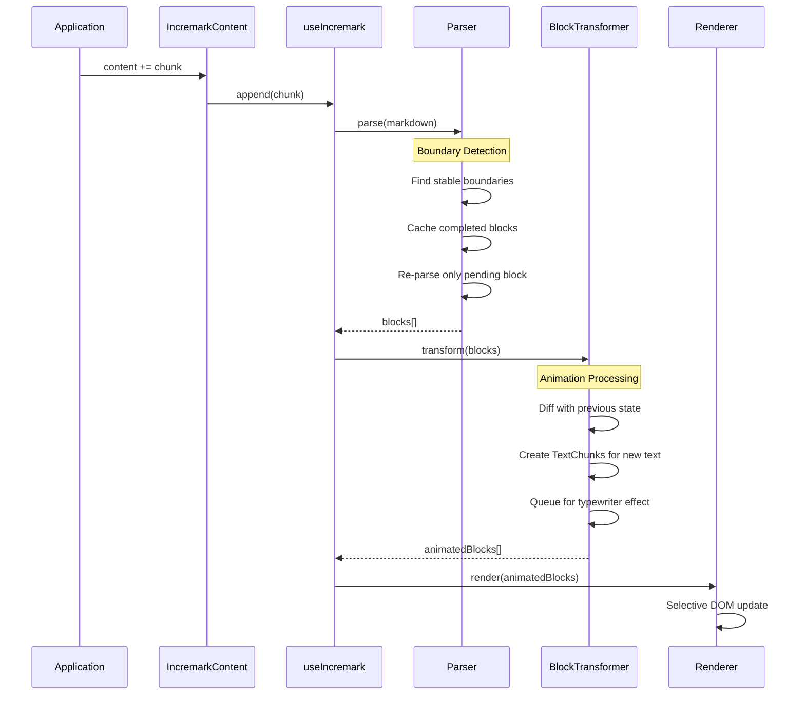

# Architecture

This document explains the internal architecture of Incremark, helping you understand how the library achieves high-performance streaming markdown rendering.

## Overall Architecture

```
┌─────────────────────────────────────────────────────────────────┐
│                      IncremarkContent                           │
│  (Declarative component, handles content/stream input)          │
└─────────────────────────────────────────────────────────────────┘
                              ↓
┌─────────────────────────────────────────────────────────────────┐
│                       useIncremark                              │
│  (State management, reactive wrapper, typewriter coordination)  │
└─────────────────────────────────────────────────────────────────┘
                              ↓
┌─────────────────────────────────────────────────────────────────┐
│                      IncremarkParser                            │
│  ┌─────────────────────────────────────────────────────────┐   │
│  │              Dual-Engine AST Builder                     │   │
│  │  ┌──────────────────┐    ┌──────────────────┐           │   │
│  │  │  MarkedAstBuilder│    │MicromarkAstBuilder│          │   │
│  │  │  (Default, Fast) │    │ (Stable, Strict) │           │   │
│  │  └──────────────────┘    └──────────────────┘           │   │
│  └─────────────────────────────────────────────────────────┘   │
│  ┌───────────────┐  ┌───────────────┐  ┌───────────────┐       │
│  │   Boundary    │  │  Definition   │  │   Footnote    │       │
│  │   Detector    │  │   Manager     │  │   Manager     │       │
│  └───────────────┘  └───────────────┘  └───────────────┘       │
└─────────────────────────────────────────────────────────────────┘
                              ↓
┌─────────────────────────────────────────────────────────────────┐
│                     BlockTransformer                            │
│  (Typewriter effect, character-level incremental rendering)     │
│  ┌───────────────┐  ┌───────────────┐  ┌───────────────┐       │
│  │    Plugins    │  │     Chunk     │  │   TextChunk   │       │
│  │    System     │  │   Animation   │  │    Tracking   │       │
│  └───────────────┘  └───────────────┘  └───────────────┘       │
└─────────────────────────────────────────────────────────────────┘
                              ↓
┌─────────────────────────────────────────────────────────────────┐
│                        Renderer                                 │
│  ┌──────────────┐  ┌──────────────┐  ┌──────────────┐          │
│  │     Vue      │  │    React     │  │    Svelte    │          │
│  │  Components  │  │  Components  │  │  Components  │          │
│  └──────────────┘  └──────────────┘  └──────────────┘          │
└─────────────────────────────────────────────────────────────────┘
```

## Dual-Engine Architecture

Incremark supports two parsing engines that can be switched at runtime:

### MarkedAstBuilder (Default)

The `marked` engine is optimized for streaming performance:

- **Speed**: Extremely fast tokenization, ideal for real-time AI chat
- **Extensions**: Custom extensions for footnotes, math, containers, inline HTML
- **Trade-off**: Slightly less strict CommonMark compliance

```ts
// Internal: packages/core/src/parser/ast/MarkedAstBuildter.ts
class MarkedAstBuilder implements IAstBuilder {
  // Custom marked extensions
  private extensions = [
    createFootnoteDefinitionExtension(),
    createBlockMathExtension(),
    createInlineMathExtension(),
    createContainerExtension(),
    createInlineHtmlExtension()
  ]
}
```

### MicromarkAstBuilder

The `micromark` engine prioritizes correctness and extensibility:

- **Compliance**: Strict CommonMark specification adherence
- **Ecosystem**: Full access to micromark/mdast plugin ecosystem
- **Trade-off**: Slightly higher overhead for parsing

```ts
// Internal: packages/core/src/parser/ast/MicromarkAstBuilder.ts
class MicromarkAstBuilder implements IAstBuilder {
  // Uses mdast-util-from-markdown with micromark extensions
}
```

### Engine Selection

Both engines produce identical mdast output, ensuring consistent rendering:

```ts
// Default: uses marked (fast mode)
const parser = new IncremarkParser({ gfm: true, math: true })

// To use micromark (import separately for tree-shaking)
import { MicromarkAstBuilder } from '@incremark/core/engines/micromark'
const parser = new IncremarkParser({
  astBuilder: MicromarkAstBuilder,
  gfm: true,
  math: true
})
```

## Core Components

### IncremarkParser

The central coordinator that manages the incremental parsing pipeline:

| Component | Responsibility |
|-----------|---------------|
| **BoundaryDetector** | Identifies stable boundaries (empty lines, new headings) to commit completed blocks |
| **AstBuilder** | Constructs mdast nodes from markdown text using the selected engine |
| **DefinitionManager** | Tracks link/image definitions across the document |
| **FootnoteManager** | Manages footnote definitions and references |

### BlockTransformer

Handles the typewriter animation layer:

| Component | Responsibility |
|-----------|---------------|
| **Plugins System** | Extensible plugin architecture for custom behavior |
| **Chunk Animation** | Manages the queue of text chunks to animate |
| **TextChunk Tracking** | Tracks which characters have been "played" for smooth animation |

### Renderer

Framework-specific rendering components:

- **Vue**: `@incremark/vue` - Uses Vue 3.5 Composition API
- **React**: `@incremark/react` - Uses React 18 hooks
- **Svelte**: `@incremark/svelte` - Uses Svelte 5 runes

All renderers share the same core logic and produce identical DOM output.

## Data Flow



## Performance Optimizations

### 1. Incremental Line Parsing

Only new lines are parsed; completed blocks are cached:

```ts
// Simplified concept
if (line.isNewlyAdded) {
  parse(line)
} else if (block.isCompleted) {
  return cachedAST[block.id]
}
```

### 2. Stable Block IDs

Each block receives a stable ID, enabling efficient React/Vue reconciliation:

```ts
interface Block {
  id: string      // Stable across updates
  node: RootContent
  status: 'pending' | 'completed'
}
```

### 3. AST Incremental Appending

New nodes are appended to the existing tree without rebuilding:

```ts
// Instead of: root = parse(entireMarkdown)
// We do:
existingRoot.children.push(...newNodes)
```

### 4. Context Caching

Parser state is preserved between chunks for efficient resumption:

```ts
interface ParserContext {
  inFencedCode: boolean
  inContainer: boolean
  listStack: ListInfo[]
  blockquoteDepth: number
}
```

## Extension Points

Incremark provides multiple extension points:

| Level | Extension Type | Example |
|-------|---------------|---------|
| **Parser** | micromark extensions | Custom syntax |
| **Parser** | mdast extensions | Custom AST nodes |
| **Parser** | marked transformers | Custom token handling |
| **Renderer** | Custom components | Replace heading rendering |
| **Renderer** | Custom code blocks | Echarts, Mermaid |
| **Renderer** | Custom containers | Warning, Info boxes |

See [Extensions](/advanced/extensions) for detailed documentation.
