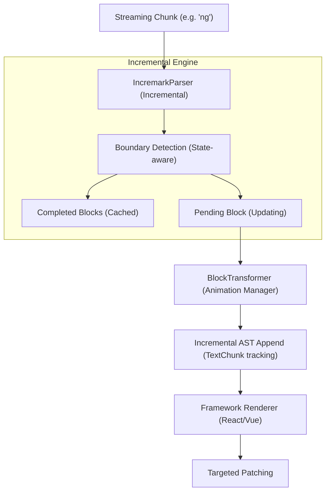
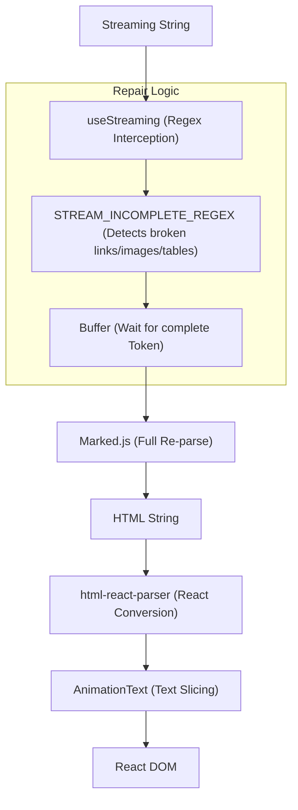
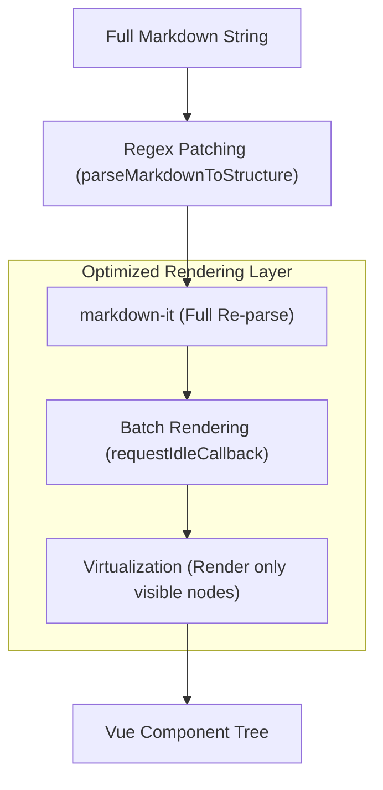

# Comparison with Other Solutions

This guide provides a deep technical comparison between **Incremark**, **Ant Design X Markdown**, and **MarkStream Vue**, analyzing their architectural implementation of streaming Markdown rendering.

## Architecture & Flow

### 1. Incremark (Our Solution)

**Strategy: Incremental Parsing + Structural Typewriter Animation**

*   **Key Advantage**: Only parses what is new or unstable. Animation happens at the AST node level, avoiding re-traversal of stable nodes. Performance is **O(N)**.

---

### 2. Ant Design X (`x-markdown`)

**Strategy: Regex Repair + Full Re-parsing (Marked)**

*   **Key Advantage**: Robust visual state patching via regex. However, it requires a full re-parse of the entire accumulated string on every update. Performance is **O(N²)**.

---

### 3. MarkStream Vue

**Strategy: Full Re-parsing + Virtualized/Batched Rendering (markdown-it)**

*   **Key Advantage**: Accepts the cost of re-parsing but optimizes the DOM layer via virtualization and idling batch updates. Perfect for viewing extremely large history or static documents.

---

## Technical Comparison Matrix

| Dimension | Ant Design X (epx) | MarkStream Vue (epx2) | Incremark (core) |
| :--- | :--- | :--- | :--- |
| **Parsing Engine** | `marked` | `markdown-it` | **Dual-Engine: `marked` (default) + `micromark`** |
| **Parsing Strategy** | Full Re-parse | Full Re-parse | **Incremental Parsing** |
| **Parsing Complexity** | O(N²) | O(N²) | **O(N)** |
| **Boundary Handling** | **Regex Interception** | **Regex Patching** | **State-based Boundary Detection** |
| **Typewriter Effect** | Text Layer (String slicing) | Component Layer (`<transition>`) | **AST Node Layer** (Incremental Append) |
| **Animation Perf** | Degrades with content length | O(1) per mounting | **Constant CPU usage per tick** |
| **Big Doc Optimization** | None | **Virtualization + Batching** | **Stable IDs + Selective Rendering** |
| **Plugin Ecosystem** | Limited | markdown-it plugins | **micromark + mdast + marked extensions** |
| **Framework Support** | React | Vue | **Vue + React + Svelte (Shared Core)** |

---

## Deep Dive

### 1. Incremental vs Full Parsing
For a 10,000-character document with 10 new characters added:
- **Full Parsing**: The parser must scan all 10,010 characters. Processing time grows exponentially with conversation length.
- **Incremental Parsing**: `IncremarkParser` identifies the first 10,000 characters as belonging to "stable blocks" and only performs limited contextual analysis on the new 10 characters.

### 2. Animation Precision
- **Text Layer (Ant Design X)**: The animator doesn't know if a character belongs to a heading or a code block; it just slices a string. This can cause structural "jumping" during high-frequency updates.
- **Component Layer (MarkStream Vue)**: Animation is often restricted to paragraph or block-level fade-ins, making it hard to achieve a smooth, character-by-character "typewriter" feel.
- **AST Layer (Incremark)**: `BlockTransformer` is aware of the AST structure. It knows exactly where the new text nodes are. By maintaining a `TextChunk` queue within nodes, it enables smooth character-level animation while maintaining structural integrity (e.g., ensuring a `**bold**` block never crashes the renderer mid-animation).

---

## Conclusion & Best Use Cases

### **Ant Design X** (The Design System Choice)
*   **Best For**: Rapidly building AI chat interfaces for web applications already using Ant Design. Its regex repair strategy is very reliable for common Markdown edge cases in shorter chats.

### **MarkStream Vue** (The Document Viewer)
*   **Best For**: Vue applications that need to display extremely large AI responses or long-form documents where virtualization (scrolling performance) is the priority.

### **Incremark** (The High-Performance Standard)
*   **Best For**: Corporate-grade AI applications with long context windows (100k+ tokens), multi-framework teams, or any scenario where the smoothest possible "human-like" typing animation is required without sacrificing battery life or performance.

---

## Benchmark Results

We conducted extensive benchmarks across 38 real-world markdown documents (6,484 lines, 128.55 KB total).

> 📊 See the [complete benchmark data](/advanced/engines#complete-benchmark-data) for detailed results of all 38 test files.

### Overall Performance (Averages)

| Comparison | Average Advantage |
|------------|-------------------|
| vs Streamdown | ~**6.1x faster** |
| vs ant-design-x | ~**7.2x faster** |
| vs markstream-vue | ~**28.3x faster** |

> ⚠️ These are averages across all test scenarios. Individual performance varies by content type.

### Scaling with Document Size

The larger the document, the greater Incremark's advantage — O(n) vs O(n²):

| File | Lines | Size | Incremark | ant-design-x | Advantage |
|------|-------|------|-----------|--------------|-----------|
| introduction.md | 34 | 1.57 KB | 5.6 ms | 12.8 ms | **2.3x** |
| comparison.md | 109 | 5.39 KB | 20.5 ms | 85.2 ms | **4.1x** |
| BLOCK_TRANSFORMER.md | 489 | 9.24 KB | 75.7 ms | 619.9 ms | **8.2x** |
| test-md-01.md | 916 | 17.67 KB | 87.7 ms | 1656.9 ms | **18.9x** 🚀 |

### Understanding Performance Differences

#### Why Incremark is Sometimes "Slower" vs Streamdown

In some benchmarks, Incremark appears slower than Streamdown:

| File | Incremark | Streamdown | Reason |
|------|-----------|------------|--------|
| footnotes.md | 1.7 ms | 0.2 ms | Streamdown **doesn't support footnotes** |
| FOOTNOTE_FIX_SUMMARY.md | 22.7 ms | 0.5 ms | Same — skips footnote parsing |

**This is a feature difference, not a performance issue:**
- Streamdown skips unsupported syntax → appears faster
- Incremark fully parses footnotes, math, containers → does more work

#### Incremark's Enhanced Features

Incremark extends Marked with custom extensions that Streamdown doesn't support:

| Feature | Incremark | Streamdown |
|---------|-----------|------------|
| **Footnotes** | ✅ Full GFM footnotes | ❌ Not supported |
| **Math Blocks** | ✅ `$...$` and `$$...$$` | ⚠️ Partial |
| **Custom Containers** | ✅ `:::tip`, `:::warning` | ❌ Not supported |
| **Inline HTML Parsing** | ✅ Full HTML tree | ⚠️ Basic |

#### Where Incremark Truly Shines

For standard markdown (no footnotes), Incremark consistently outperforms:

| File | Lines | Incremark | Streamdown | vs Streamdown |
|------|-------|-----------|------------|---------------|
| concepts.md | 91 | 12.0 ms | 50.5 ms | **4.2x** |
| complex-html-examples.md | 147 | 9.0 ms | 58.8 ms | **6.6x** |
| OPTIMIZATION_SUMMARY.md | 391 | 19.1 ms | 208.4 ms | **10.9x** |
| test-md-01.md | 916 | 87.7 ms | 1441.1 ms | **16.4x** |

### Why Incremark Excels

1. **Incremental Parsing O(n)**: Each append only processes new content
2. **Linear Scaling**: Advantage grows with document size
3. **Streaming-Optimized**: Microsecond-level chunk processing
4. **Feature-Rich**: Supports footnotes, math, containers without sacrificing speed

### Ideal Use Cases

✅ **Incremark shines in:**
- AI chat with streaming output (Claude, ChatGPT, etc.)
- Real-time markdown editors
- Large document incremental rendering
- Long-running conversations with 100k+ tokens
- Content requiring footnotes, math, or custom containers

⚠️ **Consider alternatives for:**
- One-time static markdown rendering
- Very small files (<500 characters)
