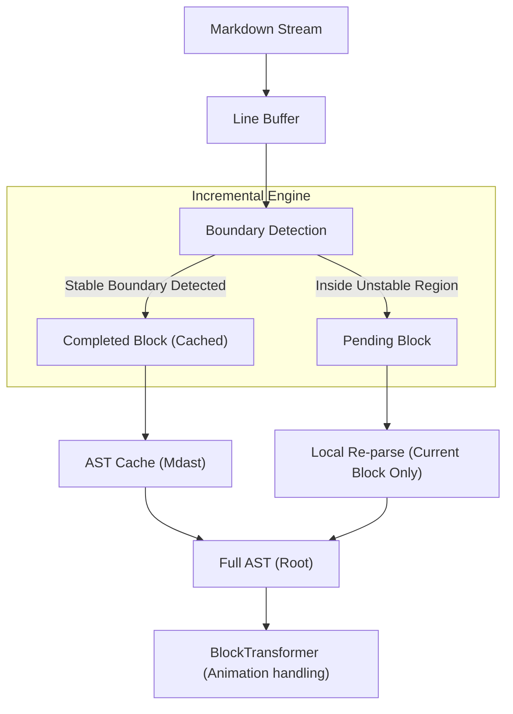

# Core Concepts

Understanding how Incremark works will help you build high-performance, flicker-free AI chat applications.

## Dual-Engine Architecture

Incremark supports two parsing engines, allowing you to choose based on your needs:

| Engine | Characteristics | Best For |
|--------|----------------|----------|
| **marked** (default) | Extremely fast, streaming-optimized | Real-time AI chat, performance-critical scenarios |
| **micromark** | CommonMark compliant, rich plugin ecosystem | Complex extensions, strict spec compliance |

Both engines share the same incremental parsing layer and produce identical mdast output, ensuring consistent behavior regardless of which engine you choose.

## Incremental Parsing Flow

Traditional Markdown parsers (like `marked` or `markdown-it`) are designed for static documents. In a streaming context, they must re-parse the entire document from scratch every time a new character is received.

**Incremark** employs a completely different "Incremental Parsing" strategy:



## Block Lifecycle

In Incremark, every top-level element (heading, paragraph, code block, etc.) is treated as an independent **Block**. They go through a lifecycle from "uncertain" to "stable":

| State | Description | Handling Strategy |
| :--- | :--- | :--- |
| **Pending** | Currently streaming; content and type may change at any time. | Every time new content arrives, a micro-parse is performed only on the text segment for this block. |
| **Completed** | Confirmed as finished; subsequent input will not affect this block. | **Persistent Cache**. Unless the stream is reset, it is no longer involved in parsing or re-rendering. |

> [!TIP]
> **Why do we need a Pending state?**
> In Markdown, the prefix determines the type. For example, when `#` is input, it could be a heading or just text. The type is only truly determined when a space or newline is received.

## Boundary Detection Rules

Incremark uses heuristic rules to determine when a block can transition from `Pending` to `Completed`:

### 1. Simple Block Boundaries
*   **Empty Line**: The natural end of a paragraph.
*   **New Heading / Thematic Break**: The appearance of a new block implies the end of the previous non-container block.

### 2. Fenced Block Boundaries
*   **Code Block (```)**: Must detect a matching closing fence. Until the closing fence appears, the entire code block remains `Pending`.
*   **Custom Container (:::)**: Same as above; supports nested detection.

### 3. Nested Block Boundaries
*   **Lists and Blockquotes**: The parser continuously tracks the current indentation level and blockquote depth. When a new line's indentation retreats or the quote marker disappears, the previous block is determined to be finished.

## Context Tracking

To accurately identify boundaries during the streaming process, the parser maintains a lightweight state machine:

```ts
interface BlockContext {
  inFencedCode: boolean;     // Processing a code block
  inContainer: boolean;      // Processing a custom container
  listStack: ListInfo[];     // Tracking nested list state
  blockquoteDepth: number;   // Tracking blockquote depth
}
```

## Performance Analysis

Thanks to the incremental mechanism, Incremark's performance is almost independent of the total document length and only linearly related to the current chunk size.

| Dimension | Traditional Full Parsing | Incremark Incremental Parsing |
| :--- | :--- | :--- |
| **Incremental Complexity** | O(N) | **O(K)** |
| **Total Parsing Complexity** | O(N²) | **O(N)** |
| **Memory Overhead** | High (Repeated object creation) | **Low (Incremental AST reuse)** |
| **UI Responsiveness** | Performance degrades as N grows | **Maintains 60fps smooth performance** |

*Note: N is total document length, K is current chunk size.*

## Typewriter Effect (BlockTransformer)

After the AST is parsed, the `BlockTransformer` acts as a filtering layer before rendering. It converts the "instant results" of parsing into a "progressive process":

1.  **Node Tracking**: Keeps track of which characters have already been "played."
2.  **TextChunk Wrapping**: Wraps newly added text nodes into `TextChunk`, allowing the rendering layer to implement fade-in animations.
3.  **Smart Skipping**: It can strategically skip animations if the user requests immediate display or for non-text nodes (like images).
