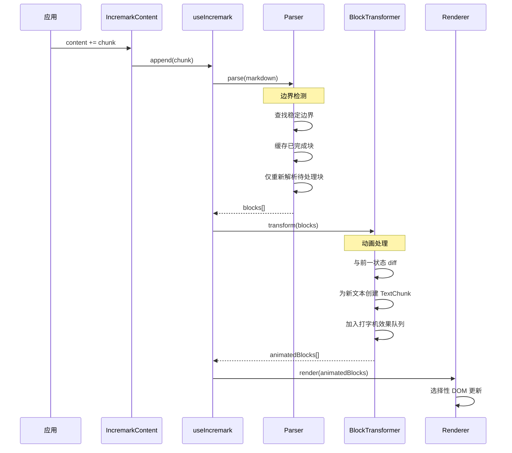

# 架构原理

本文档解释 Incremark 的内部架构，帮助你理解库是如何实现高性能流式 Markdown 渲染的。

## 整体架构

```
┌─────────────────────────────────────────────────────────────────┐
│                      IncremarkContent                           │
│  (声明式组件，处理 content/stream 输入)                          │
└─────────────────────────────────────────────────────────────────┘
                              ↓
┌─────────────────────────────────────────────────────────────────┐
│                       useIncremark                              │
│  (状态管理，响应式封装，打字机协调)                               │
└─────────────────────────────────────────────────────────────────┘
                              ↓
┌─────────────────────────────────────────────────────────────────┐
│                      IncremarkParser                            │
│  ┌─────────────────────────────────────────────────────────┐   │
│  │              双引擎 AST 构建器                            │   │
│  │  ┌──────────────────┐    ┌──────────────────┐           │   │
│  │  │  MarkedAstBuilder│    │MicromarkAstBuilder│          │   │
│  │  │  (默认，极速)     │    │ (稳定，严格)      │           │   │
│  │  └──────────────────┘    └──────────────────┘           │   │
│  └─────────────────────────────────────────────────────────┘   │
│  ┌───────────────┐  ┌───────────────┐  ┌───────────────┐       │
│  │    边界       │  │    定义       │  │    脚注       │       │
│  │   检测器      │  │   管理器      │  │   管理器      │       │
│  └───────────────┘  └───────────────┘  └───────────────┘       │
└─────────────────────────────────────────────────────────────────┘
                              ↓
┌─────────────────────────────────────────────────────────────────┐
│                     BlockTransformer                            │
│  (打字机效果，字符级增量渲染)                                     │
│  ┌───────────────┐  ┌───────────────┐  ┌───────────────┐       │
│  │    插件       │  │    Chunk      │  │   TextChunk   │       │
│  │    系统       │  │    动画       │  │    追踪       │       │
│  └───────────────┘  └───────────────┘  └───────────────┘       │
└─────────────────────────────────────────────────────────────────┘
                              ↓
┌─────────────────────────────────────────────────────────────────┐
│                        渲染器                                    │
│  ┌──────────────┐  ┌──────────────┐  ┌──────────────┐          │
│  │     Vue      │  │    React     │  │    Svelte    │          │
│  │    组件库     │  │    组件库     │  │    组件库    │          │
│  └──────────────┘  └──────────────┘  └──────────────┘          │
└─────────────────────────────────────────────────────────────────┘
```

## 双引擎架构

Incremark 支持两种解析引擎，通过注入不同的 AstBuilder 实现切换（支持 tree-shaking）：

### MarkedAstBuilder（默认）

`marked` 引擎针对流式性能进行了优化：

- **速度**：极速的词法分析，非常适合实时 AI 聊天
- **扩展**：自定义扩展支持脚注、数学公式、容器、内联 HTML
- **权衡**：CommonMark 兼容性略低

```ts
// 内部实现: packages/core/src/parser/ast/MarkedAstBuildter.ts
class MarkedAstBuilder implements IAstBuilder {
  // 自定义 marked 扩展
  private extensions = [
    createFootnoteDefinitionExtension(),
    createBlockMathExtension(),
    createInlineMathExtension(),
    createContainerExtension(),
    createInlineHtmlExtension()
  ]
}
```

### MicromarkAstBuilder

`micromark` 引擎优先考虑正确性和可扩展性：

- **兼容性**：严格遵循 CommonMark 规范
- **生态**：完整的 micromark/mdast 插件生态
- **权衡**：解析开销略高

```ts
// 内部实现: packages/core/src/parser/ast/MicromarkAstBuilder.ts
class MicromarkAstBuilder implements IAstBuilder {
  // 使用 mdast-util-from-markdown 配合 micromark 扩展
}
```

### 引擎选择

两个引擎产生相同的 mdast 输出，确保渲染一致性：

```ts
// 默认使用 marked（极速模式）
const parser = new IncremarkParser({ gfm: true, math: true })

// 使用 micromark（需要单独导入）
import { MicromarkAstBuilder } from '@incremark/core/engines/micromark'
const parser = new IncremarkParser({
  astBuilder: MicromarkAstBuilder,
  gfm: true,
  math: true
})
```

## 核心组件

### IncremarkParser

管理增量解析流程的核心协调器：

| 组件 | 职责 |
|------|------|
| **BoundaryDetector** | 识别稳定边界（空行、新标题）以提交已完成的块 |
| **AstBuilder** | 使用选定引擎从 markdown 文本构建 mdast 节点 |
| **DefinitionManager** | 跟踪文档中的链接/图片定义 |
| **FootnoteManager** | 管理脚注定义和引用 |

### BlockTransformer

处理打字机动画层：

| 组件 | 职责 |
|------|------|
| **Plugins System** | 可扩展的插件架构，支持自定义行为 |
| **Chunk Animation** | 管理待动画的文本块队列 |
| **TextChunk Tracking** | 追踪哪些字符已经"播放"，实现平滑动画 |

### 渲染器

框架特定的渲染组件：

- **Vue**: `@incremark/vue` - 使用 Vue 3.5 Composition API
- **React**: `@incremark/react` - 使用 React 18 hooks
- **Svelte**: `@incremark/svelte` - 使用 Svelte 5 runes

所有渲染器共享相同的核心逻辑，产生相同的 DOM 输出。

## 数据流



## 性能优化

### 1. 增量行解析

仅解析新行；已完成的块被缓存：

```ts
// 简化概念
if (line.isNewlyAdded) {
  parse(line)
} else if (block.isCompleted) {
  return cachedAST[block.id]
}
```

### 2. 稳定块 ID

每个块获得一个稳定的 ID，实现高效的 React/Vue 协调：

```ts
interface Block {
  id: string      // 跨更新保持稳定
  node: RootContent
  status: 'pending' | 'completed'
}
```

### 3. AST 增量追加

新节点被追加到现有树中，无需重建：

```ts
// 不是: root = parse(entireMarkdown)
// 而是:
existingRoot.children.push(...newNodes)
```

### 4. 上下文缓存

解析器状态在 chunk 之间保留，实现高效恢复：

```ts
interface ParserContext {
  inFencedCode: boolean
  inContainer: boolean
  listStack: ListInfo[]
  blockquoteDepth: number
}
```

## 扩展点

Incremark 提供多个扩展点：

| 层级 | 扩展类型 | 示例 |
|------|---------|------|
| **解析器** | micromark 扩展 | 自定义语法 |
| **解析器** | mdast 扩展 | 自定义 AST 节点 |
| **解析器** | marked 转换器 | 自定义 token 处理 |
| **渲染器** | 自定义组件 | 替换标题渲染 |
| **渲染器** | 自定义代码块 | Echarts, Mermaid |
| **渲染器** | 自定义容器 | Warning, Info 框 |

详细文档请参阅[扩展功能](/zh/advanced/extensions)。
