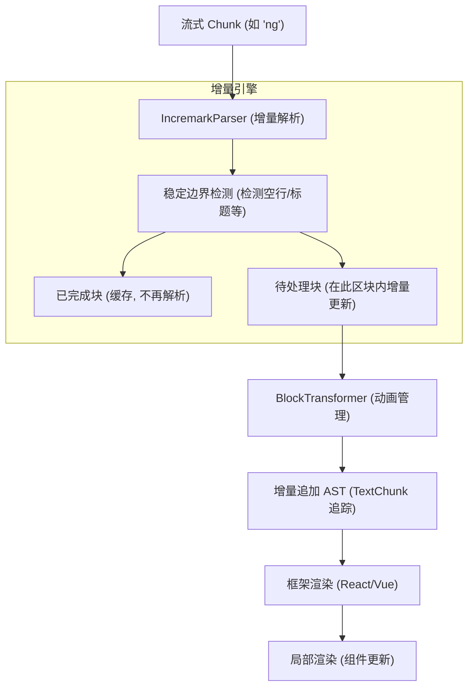
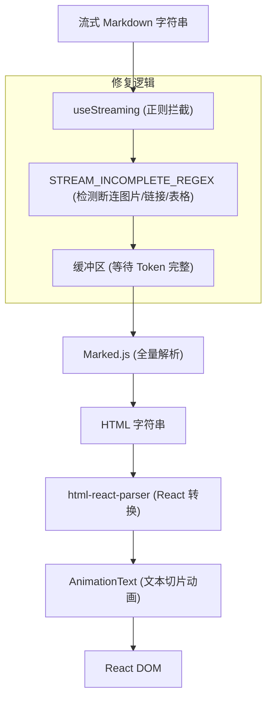
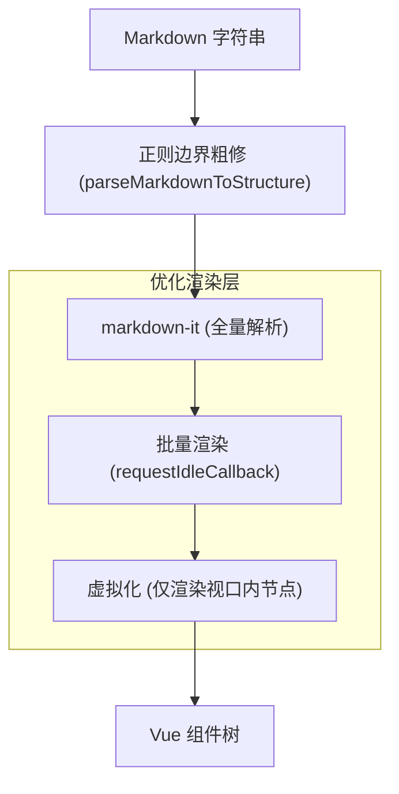

# 方案对比

本文档对流式 Markdown 渲染方案进行深度技术对比：**Incremark**、**ant-design-x** (Ant Design X Markdown) 和 **markstream-vue**。

## 全流程图解

### 1. Incremark (本方案)

**策略：增量解析 + 结构化打字机动画**

*   **关键特点**：仅解析新增或未完成的部分。动画在 AST 节点层操作，已稳定节点不重复遍历。性能复杂度为 **O(N)**。

---

### 2. ant-design-x (Ant Design X)

**策略：正则边界修复 + 全量解析 (Marked)**

*   **关键特点**：通过复杂的正则预判 Markdown 语法截断。每次更新都需将历史全量内容重新解析为 HTML。动画在纯文本层通过字符串切片实现。性能复杂度为 **O(N²)**。

---

### 3. markstream-vue

**策略：全量解析 + 虚拟化/批量渲染 (markdown-it)**

*   **关键特点**：虽然采用全量解析，但通过极其精细的渲染层控制（虚拟化、首屏优化、空闲时间批量更新）解决了超长文档的渲染卡顿问题。适用于阅读大型静态文档或历史对话。

---

## 核心原理对比

| 维度 | ant-design-x (epx) | markstream-vue (epx2) | Incremark (core) |
| :--- | :--- | :--- | :--- |
| **解析引擎** | `marked` | `markdown-it` | **自研增量引擎 (IncremarkParser)** |
| **解析策略** | 全量解析 (Full Re-parse) | 全量解析 (Full Re-parse) | **增量解析 (Incremental)** |
| **性能复杂度** | O(N²) | O(N²) | **O(N)** |
| **流式边界处理** | **正则修复** (精准拦截不完整 Token) | **正则粗修** (裁剪末尾危险字符) | **稳定边界检测** (基于状态机的上下文感知) |
| **打字机动画** | 纯文本层 (字符串切片) | 组件层 (`<transition>`) | **AST 节点层** (TextChunk 增量追加) |
| **动画性能** | 随内容增长 CPU 消耗增加 | O(1) 挂载开销 | **恒定 CPU 消耗 (仅处理新增字符)** |
| **大文档优化** | 无 | **强制虚拟化 + 批量渲染** | **稳定 ID + 局部更新** |
| **框架支持** | React | Vue | **Vue + React (共享核心逻辑)** |

---

## 技术细节深究

### 1. 增量解析 vs 全量解析
当文档长度为 10,000 字时，新推入 10 个字：
- **全量方案 (ant-design-x / markstream-vue)**：解析器需要扫描并分析 10,010 个字符。随着对话增长，解析耗时呈指数级上升。
- **增量方案 (Incremark)**：`IncremarkParser` 识别出前 10,000 字已处于“稳定块”，直接从缓冲区读取已有的 AST，仅对新增的 10 个字符进行有限上下文分析。

### 2. 动画实现层级
- **文本层 (ant-design-x)**：动画器不知道当前字符属于标题还是代码块，只是机械地切分字符串。这在处理高频更新时容易导致结构闪烁。
- **组件层 (markstream-vue)**：动画粒度较粗，通常是整个段落或块级节点的渐入，较难实现丝滑的逐字符打字感。
- **AST 层 (Incremark)**：`BlockTransformer` 感知 AST 结构。它知道哪里是新增的文本节点。通过在 AST 节点内部维护 `TextChunk` 队列，可以实现跨节点的平滑打字效果，同时保证 Markdown 结构的完整性（例如：永远不会在 `**bold**` 动画中间由于结构未闭合而导致渲染崩溃）。

---

## 各自优势与适用场景

### **Ant Design X** (AI 专用组件库)
*   **优势**：组件套件及其完备（包含 Bubble, Prompt 等），与 Ant Design 视觉风格高度统一。其正则修复策略在处理极其复杂的截断（如链接中途截断）时表现非常稳健。
*   **适用场景**：需要快速搭建基于 Ant Design 的标准 AI 聊天室，且文档长度适中的场景。

### **markstream-vue** (大规模文档专家)
*   **优势**：内置了极其强大的虚拟化渲染和批量更新机制。即使解析效率不是最高的，但渲染层足以支撑万级以上节点的列表展示而不掉帧。
*   **适用场景**：需要展示超长 AI 响应结果、长篇 PDF 解析结果或需要复杂虚拟化滚动的 Vue 应用。

### **Incremark** (极致流式体验)
*   **优势**：
    1.  **极低延迟**：增量解析保证了即使在长达数十万 Token 的会话中，每一帧的响应时间依然保持在 1ms 以内。
    2.  **高性能动画**：结构化动画方案降低了 90% 以上的无用 DOM 更新。
    3.  **开发灵活性**：一套核心 API 同时支持 Vue、React 和 Svelte 等多个框架，且完全兼容 mdast。
*   **适用场景**：对实时性要求极高、存在长上下文流式输出、或需要在多个技术栈间复用渲染逻辑的商业级 AI 应用。
