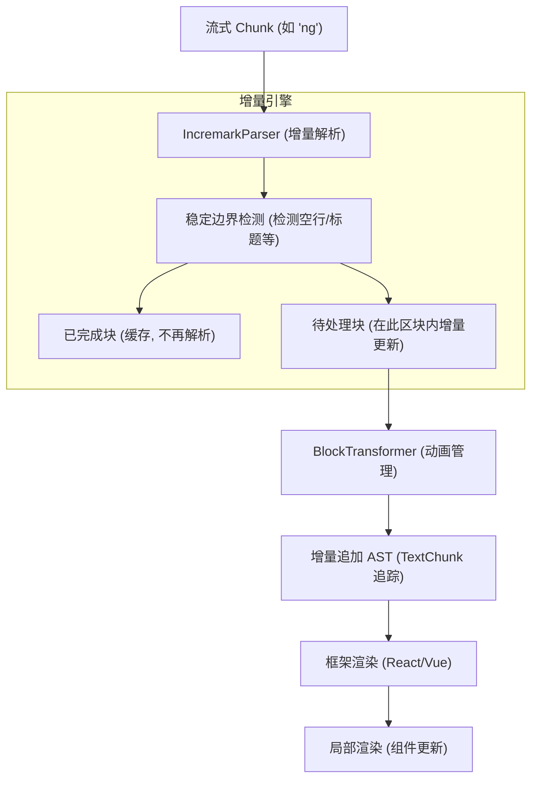
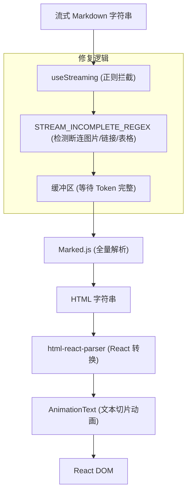
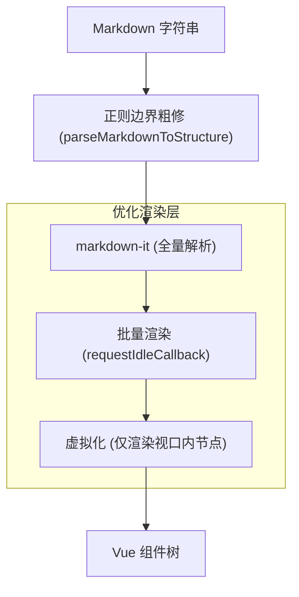

# 方案对比

本文档对流式 Markdown 渲染方案进行深度技术对比：**Incremark**、**ant-design-x** (Ant Design X Markdown) 和 **markstream-vue**。

## 全流程图解

### 1. Incremark (本方案)

**策略：增量解析 + 结构化打字机动画**

*   **关键特点**：仅解析新增或未完成的部分。动画在 AST 节点层操作，已稳定节点不重复遍历。性能复杂度为 **O(N)**。

---

### 2. ant-design-x (Ant Design X)

**策略：正则边界修复 + 全量解析 (Marked)**

*   **关键特点**：通过复杂的正则预判 Markdown 语法截断。每次更新都需将历史全量内容重新解析为 HTML。动画在纯文本层通过字符串切片实现。性能复杂度为 **O(N²)**。

---

### 3. markstream-vue

**策略：全量解析 + 虚拟化/批量渲染 (markdown-it)**

*   **关键特点**：虽然采用全量解析，但通过极其精细的渲染层控制（虚拟化、首屏优化、空闲时间批量更新）解决了超长文档的渲染卡顿问题。适用于阅读大型静态文档或历史对话。

---

## 核心原理对比

| 维度 | ant-design-x (epx) | markstream-vue (epx2) | Incremark (core) |
| :--- | :--- | :--- | :--- |
| **解析引擎** | `marked` | `markdown-it` | **双引擎：`marked`（默认）+ `micromark`** |
| **解析策略** | 全量解析 (Full Re-parse) | 全量解析 (Full Re-parse) | **增量解析 (Incremental)** |
| **性能复杂度** | O(N²) | O(N²) | **O(N)** |
| **流式边界处理** | **正则修复** (精准拦截不完整 Token) | **正则粗修** (裁剪末尾危险字符) | **稳定边界检测** (基于状态机的上下文感知) |
| **打字机动画** | 纯文本层 (字符串切片) | 组件层 (`<transition>`) | **AST 节点层** (TextChunk 增量追加) |
| **动画性能** | 随内容增长 CPU 消耗增加 | O(1) 挂载开销 | **恒定 CPU 消耗 (仅处理新增字符)** |
| **大文档优化** | 无 | **强制虚拟化 + 批量渲染** | **稳定 ID + 局部更新** |
| **插件生态** | 有限 | markdown-it 插件 | **micromark + mdast + marked 扩展** |
| **框架支持** | React | Vue | **Vue + React + Svelte (共享核心逻辑)** |

---

## 技术细节深究

### 1. 增量解析 vs 全量解析
当文档长度为 10,000 字时，新推入 10 个字：
- **全量方案 (ant-design-x / markstream-vue)**：解析器需要扫描并分析 10,010 个字符。随着对话增长，解析耗时呈指数级上升。
- **增量方案 (Incremark)**：`IncremarkParser` 识别出前 10,000 字已处于“稳定块”，直接从缓冲区读取已有的 AST，仅对新增的 10 个字符进行有限上下文分析。

### 2. 动画实现层级
- **文本层 (ant-design-x)**：动画器不知道当前字符属于标题还是代码块，只是机械地切分字符串。这在处理高频更新时容易导致结构闪烁。
- **组件层 (markstream-vue)**：动画粒度较粗，通常是整个段落或块级节点的渐入，较难实现丝滑的逐字符打字感。
- **AST 层 (Incremark)**：`BlockTransformer` 感知 AST 结构。它知道哪里是新增的文本节点。通过在 AST 节点内部维护 `TextChunk` 队列，可以实现跨节点的平滑打字效果，同时保证 Markdown 结构的完整性（例如：永远不会在 `**bold**` 动画中间由于结构未闭合而导致渲染崩溃）。

---

## 各自优势与适用场景

### **Ant Design X** (AI 专用组件库)
*   **优势**：组件套件及其完备（包含 Bubble, Prompt 等），与 Ant Design 视觉风格高度统一。其正则修复策略在处理极其复杂的截断（如链接中途截断）时表现非常稳健。
*   **适用场景**：需要快速搭建基于 Ant Design 的标准 AI 聊天室，且文档长度适中的场景。

### **markstream-vue** (大规模文档专家)
*   **优势**：内置了极其强大的虚拟化渲染和批量更新机制。即使解析效率不是最高的，但渲染层足以支撑万级以上节点的列表展示而不掉帧。
*   **适用场景**：需要展示超长 AI 响应结果、长篇 PDF 解析结果或需要复杂虚拟化滚动的 Vue 应用。

### **Incremark** (极致流式体验)
*   **优势**：
    1.  **极低延迟**：增量解析保证了即使在长达数十万 Token 的会话中，每一帧的响应时间依然保持在 1ms 以内。
    2.  **高性能动画**：结构化动画方案降低了 90% 以上的无用 DOM 更新。
    3.  **开发灵活性**：一套核心 API 同时支持 Vue、React 和 Svelte 等多个框架，且完全兼容 mdast。
*   **适用场景**：对实时性要求极高、存在长上下文流式输出、或需要在多个技术栈间复用渲染逻辑的商业级 AI 应用。

---

## 基准测试结果

我们在 38 个真实 markdown 文档上进行了广泛的基准测试（共 6,484 行，128.55 KB）。

> 📊 查看[完整的基准测试数据](/zh/advanced/engines#完整基准测试数据)，包含所有 38 个测试文件的详细结果。

### 总体性能对比（平均值）

| 对比方案 | 平均优势 |
|----------|----------|
| vs Streamdown | 约**快 6.1 倍** |
| vs ant-design-x | 约**快 7.2 倍** |
| vs markstream-vue | 约**快 28.3 倍** |

> ⚠️ 以上是所有测试场景的平均结果。单个文件的性能表现会因内容类型而异。

### 随文档大小扩展的性能表现

文档越大，Incremark 的优势越明显 —— O(n) vs O(n²)：

| 文件 | 行数 | 大小 | Incremark | ant-design-x | 优势倍数 |
|------|------|------|-----------|--------------|----------|
| introduction.md | 34 | 1.57 KB | 5.6 ms | 12.8 ms | **2.3x** |
| comparison.md | 109 | 5.39 KB | 20.5 ms | 85.2 ms | **4.1x** |
| BLOCK_TRANSFORMER.md | 489 | 9.24 KB | 75.7 ms | 619.9 ms | **8.2x** |
| test-md-01.md | 916 | 17.67 KB | 87.7 ms | 1656.9 ms | **18.9x** 🚀 |

### 理解性能差异

#### 为什么 Incremark 有时比 Streamdown "更慢"

在某些基准测试中，Incremark 看起来比 Streamdown 慢：

| 文件 | Incremark | Streamdown | 原因 |
|------|-----------|------------|------|
| footnotes.md | 1.7 ms | 0.2 ms | Streamdown **不支持脚注** |
| FOOTNOTE_FIX_SUMMARY.md | 22.7 ms | 0.5 ms | 同上 — 跳过脚注解析 |

**这是功能差异，不是性能问题：**
- Streamdown 跳过不支持的语法 → 看起来更快
- Incremark 完整解析脚注、数学公式、容器 → 做了更多工作

#### Incremark 的增强功能

Incremark 通过自定义扩展增强了 Marked，这些是 Streamdown 不支持的：

| 功能 | Incremark | Streamdown |
|------|-----------|------------|
| **脚注** | ✅ 完整 GFM 脚注 | ❌ 不支持 |
| **数学公式** | ✅ `$...$` 和 `$$...$$` | ⚠️ 部分支持 |
| **自定义容器** | ✅ `:::tip`、`:::warning` | ❌ 不支持 |
| **内联 HTML 解析** | ✅ 完整 HTML 树 | ⚠️ 基础支持 |

#### Incremark 真正的优势场景

对于标准 markdown（不含脚注），Incremark 持续领先：

| 文件 | 行数 | Incremark | Streamdown | vs Streamdown |
|------|------|-----------|------------|---------------|
| concepts.md | 91 | 12.0 ms | 50.5 ms | **4.2x** |
| complex-html-examples.md | 147 | 9.0 ms | 58.8 ms | **6.6x** |
| OPTIMIZATION_SUMMARY.md | 391 | 19.1 ms | 208.4 ms | **10.9x** |
| test-md-01.md | 916 | 87.7 ms | 1441.1 ms | **16.4x** |

### 为什么 Incremark 如此出色

1. **增量解析 O(n)**：每次 append 只处理新内容
2. **线性扩展**：优势随文档大小增长
3. **流式优化**：微秒级的 chunk 处理
4. **功能丰富**：支持脚注、数学公式、容器，且不牺牲速度

### 最佳使用场景

✅ **Incremark 最适合：**
- AI 聊天流式输出（Claude、ChatGPT 等）
- 实时 Markdown 编辑器
- 大文档的增量渲染
- 100k+ token 的长对话
- 需要脚注、数学公式或自定义容器的内容

⚠️ **以下场景可考虑其他方案：**
- 一次性静态 Markdown 渲染
- 极小文件（<500 字符）
