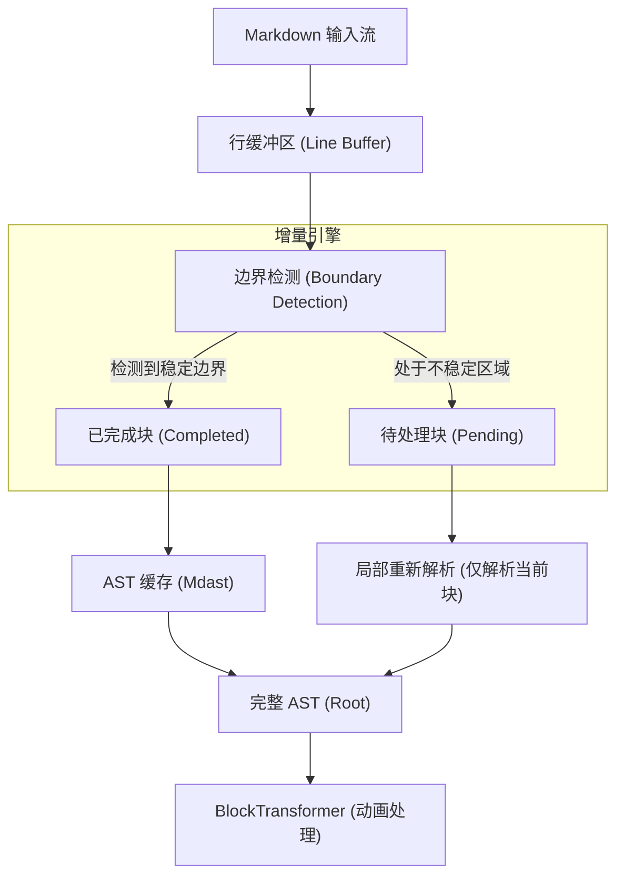

# 核心概念

理解 Incremark 的工作原理，有助于更好地构建高性能、无闪烁的 AI 对话应用。

## 增量解析流程

传统的 Markdown 解析器（如 `marked` 或 `markdown-it`）是为静态文档设计的。在流式场景下，它们每接收到一个新的字符，都必须从头重新解析整个文档。

**Incremark** 采用了完全不同的“增量解析”策略：



## Block 生命周期

在 Incremark 中，每一个顶级元素（标题、段落、代码块等）都是一个独立的 **Block**。它们经历了从“不确定”到“稳定”的生命周期：

| 状态 | 说明 | 处理策略 |
| :--- | :--- | :--- |
| **Pending** | 正在接收中，内容和类型随时可能改变 | 每次有新内容输入时，仅针对该 Block 所在的文本片段进行微型解析。 |
| **Completed** | 已确认完成，后续输入不会再影响该块 | **持久化缓存**。除非流被重置，否则不再参与解析、不再重新渲染。 |

> [!TIP]
> **为什么需要 Pending 状态？**
> 在 Markdown 中，前缀决定了类型。例如输入 `#` 时，它可能是个标题，也可能只是文本。只有当接收到空格或换行时，其类型才真正确定。

## 边界检测规则

Incremark 使用启发式规则来判断一个 Block 何时可以从 `Pending` 转换为 `Completed`：

### 1. 简单块边界
*   **空行**：段落的自然结束。
*   **新标题/分隔线**：新块的出现意味着前一个非容器块已结束。

### 2. 围栏块边界 (Fenced Blocks)
*   **代码块 (```)**：必须检测到匹配的结束围栏。在结束围栏出现前，整个代码块都处于 `Pending` 状态。
*   **自定义容器 (:::)**：同上，支持嵌套检测。

### 3. 嵌套块边界 (Nested Blocks)
*   **列表与引用**：解析器会持续跟踪当前的缩进级别和引用深度。当新的一行缩进回退或引用标记消失时，判定前块结束。

## 上下文跟踪 (Context)

为了在流式过程中准确识别边界，解析器维护了一个轻量级的状态机：

```ts
interface BlockContext {
  inFencedCode: boolean;     // 正在处理代码块
  inContainer: boolean;      // 正在处理自定义容器
  listStack: ListInfo[];     // 追踪嵌套列表状态
  blockquoteDepth: number;   // 追踪引用嵌套深度
}
```

## 性能分析

得益于增量机制，Incremark 的性能表现与文档总长度几乎无关，而仅与当前更新的 Chunk 大小线性相关。

| 维度 | 传统全量解析 | Incremark 增量解析 |
| :--- | :--- | :--- |
| **单次处理复杂度** | O(N) | **O(K)** |
| **总解析复杂度** | O(N²) | **O(N)** |
| **内存开销** | 高 (反复创建全量对象) | **低 (增量复用 AST 节点)** |
| **UI 响应性** | 随字数增加产生肉眼可见的卡顿 | **始终保持 60fps 丝滑效果** |

*注：N 为文档总长度，K 为单次 Chunk 长度。*

## 打字机效果 (BlockTransformer)

在解析出 AST 之后，`BlockTransformer` 充当了渲染之前的过滤层。它负责将解析出的“瞬间结果”转化为“渐进过程”：

1.  **节点追踪**：它记录了哪些字符已经“播放”过。
2.  **TextChunk 包装**：将新增的文本节点包装为 `TextChunk`，由渲染层实现淡入动画。
3.  **智能跳过**：如果用户要求立即显示，或者是非文本节点（如图片），它可以策略性地跳过动画。
