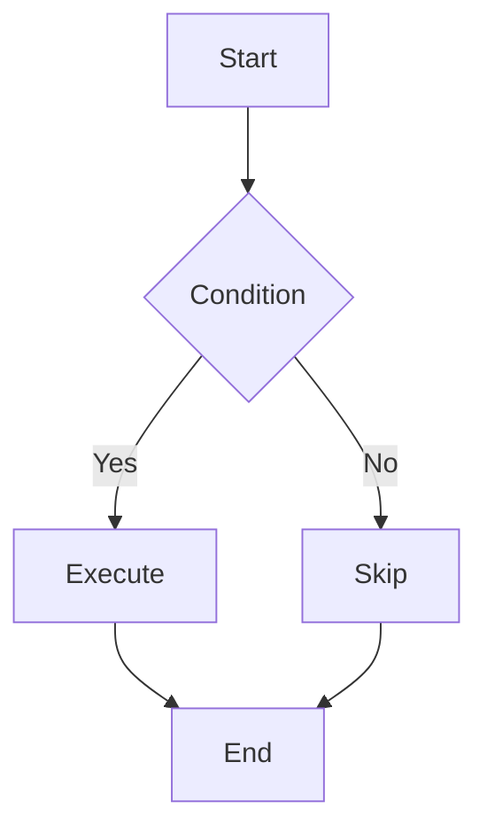
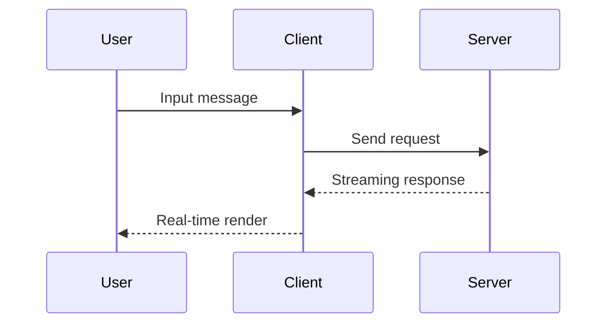

# 🚀 Incremark SolidJS Example

Welcome to **Incremark**! An incremental Markdown parser designed for AI streaming output.

## 📋 Features

Incremark provides rich features to support AI streaming output scenarios:

- ⚡ **Incremental Parsing** - Only parse new content, saving 90%+ CPU overhead
- 🔄 **Streaming Friendly** - Support char-by-char/line-by-line input with real-time rendering
- 🎯 **Boundary Detection** - Smart block boundary recognition for accurate parsing
- 🔌 **Framework Support** - Vue 3, SolidJS, SolidJS, and Svelte 5 integrations available
- 📊 **DevTools** - Built-in developer tools for debugging
- 🎨 **Customizable** - Support for custom render components, containers, and code blocks
- 📐 **Extension Support** - GFM, math formulas, Mermaid charts, and more
- ⌨️ **Typewriter Effect** - Character-by-character display animation
- 🎭 **Theme System** - Support for default, dark, and custom themes
- 📜 **Footnote Support** - Complete footnote reference and definition functionality
- 🔗 **HTML Support** - Optional HTML element parsing
- 📦 **Custom Containers** - Support for warning, tip, info, and other custom containers
- 💻 **Custom Code Blocks** - Support for ECharts, Mermaid, and other custom code block rendering

## 📐 Math Formulas

Incremark supports LaTeX math formulas, including inline and block formulas.

Inline formula: The mass-energy equation $E = mc^2$ is one of the most famous formulas in physics.

Block formula - Euler's formula:

$$
e^{i\pi} + 1 = 0
$$

Quadratic formula:

$$
x = \frac{-b \pm \sqrt{b^2 - 4ac}}{2a}
$$

## 📊 Mermaid Charts

Incremark has built-in support for Mermaid chart rendering, supporting flowcharts, sequence diagrams, and more.

### Flowchart



### Sequence Diagram



## 📝 GFM Features

Incremark supports all GitHub Flavored Markdown (GFM) features.

### Tables

| Feature | Status | Description |
|---------|--------|-------------|
| Incremental Parsing | ✅ | Core feature |
| Mermaid Charts | ✅ | Built-in support |
| Math Formulas | ✅ | LaTeX support |
| Custom Containers | ✅ | Fully supported |
| Custom Code Blocks | ✅ | Fully supported |

### Task Lists

- [x] Core parser
- [x] Vue 3 integration
- [x] React integration
- [x] SolidJS integration
- [x] Svelte 5 integration
- [x] Mermaid charts
- [x] LaTeX formulas
- [x] Custom containers
- [x] Custom code blocks
- [x] Typewriter effect
- [x] Theme system

### Strikethrough

This is ~~deleted text~~, and this is normal text.

## 🎨 Custom Containers

Incremark supports custom containers using the `::: container` syntax. Here are some examples:

:::warning
This is a **warning** container. Use it to highlight important warnings or cautions to users.
:::

:::info{title="Information"}
This is an **info** container with a custom title. Perfect for providing additional context or explanations.
:::

:::tip
This is a **tip** container. Great for sharing useful tips and best practices!
:::

Containers can also include multiple paragraphs and other Markdown elements:

:::info{title="Multi-paragraph Example"}
This is the first paragraph in the container.

This is the second paragraph. You can include:

- Lists
- **Bold text**
- *Italic text*
- Even `inline code`

All of these can be in the same container!
:::

### How to Create Custom Container Components

In SolidJS, you can create custom container components and pass them to `Incremark`:

```tsx
import { useIncremark, Incremark } from '@incremark/solid'
import { CustomWarningContainer } from './CustomWarningContainer'
import { CustomInfoContainer } from './CustomInfoContainer'
import { CustomTipContainer } from './CustomTipContainer'

function App() {
  const incremark = useIncremark({
    gfm: true,
    containers: true  // Enable container support
  })

  // Define custom container mapping
  const customContainers = {
    warning: CustomWarningContainer,
    info: CustomInfoContainer,
    tip: CustomTipContainer,
  }

  return (
    <Incremark
      incremark={incremark}
      customContainers={customContainers}
    />
  )
}
```

Custom container components receive `name` and `options` props, and use `children` to render content:

```tsx
// CustomWarningContainer.tsx
import React from 'react'

export interface CustomWarningContainerProps {
  name: string
  options?: Record<string, any>
  children?: React.ReactNode
}

export const CustomWarningContainer: React.FC<CustomWarningContainerProps> = ({ 
  options, 
  children 
}) => {
  return (
    <div className="custom-warning-container">
      <div className="custom-warning-header">
        <span className="custom-warning-icon">⚠️</span>
        <span className="custom-warning-title">
          {options?.title || 'Warning'}
        </span>
      </div>
      <div className="custom-warning-content">
        {children}
      </div>
    </div>
  )
}
```

## 📊 Custom Code Blocks

Incremark supports custom code block rendering components. For example, you can configure custom rendering for the `echarts` language:

```echarts
{
  "title": {
    "text": "Example Chart"
  },
  "xAxis": {
    "type": "category",
    "data": ["Mon", "Tue", "Wed", "Thu", "Fri", "Sat", "Sun"]
  },
  "yAxis": {
    "type": "value"
  },
  "series": [{
    "data": [120, 200, 150, 80, 70, 110, 130],
    "type": "bar"
  }]
}
```

### How to Create Custom Code Block Components

In SolidJS, you can create custom code block components and pass them to `Incremark`:

```tsx
import { useIncremark, Incremark } from '@incremark/solid'
import { CustomEchartCodeBlock } from './CustomEchartCodeBlock'

function App() {
  const incremark = useIncremark({ gfm: true })

  // Define custom code block mapping
  const customCodeBlocks = {
    echarts: CustomEchartCodeBlock,
  }

  return (
    <Incremark 
      incremark={incremark}
      customCodeBlocks={customCodeBlocks}
    />
  )
}
```

Custom code block components receive `codeStr` and `lang` props:

```tsx
// CustomEchartCodeBlock.tsx
import SolidJS, { useEffect, useRef, useState } from 'react'
import * as echarts from 'echarts'

export interface CustomEchartCodeBlockProps {
  codeStr: string
  lang?: string
}

export const CustomEchartCodeBlock: React.FC<CustomEchartCodeBlockProps> = ({ 
  codeStr 
}) => {
  const chartRef = useRef<HTMLDivElement>(null)
  const [error, setError] = useState('')
  const [loading, setLoading] = useState(false)

  useEffect(() => {
    if (!codeStr) return

    setError('')
    setLoading(true)

    try {
      const option = JSON.parse(codeStr)
      if (!chartRef.current) {
        setLoading(false)
        return
      }

      const chart = echarts.getInstanceByDom(chartRef.current)
      if (chart) {
        chart.setOption(option)
      } else {
        const newChart = echarts.init(chartRef.current)
        newChart.setOption(option)
      }
    } catch (e: any) {
      setError(e.message || 'Render failed')
    } finally {
      setLoading(false)
    }
  }, [codeStr])

  return (
    <div className="custom-echart-code-block">
      <div className="echart-header">
        <span className="language">ECHART</span>
      </div>
      <div className="echart-content">
        {loading ? (
          <div className="echart-loading">Loading...</div>
        ) : error ? (
          <div className="echart-error">{error}</div>
        ) : (
          <div ref={chartRef} className="echart-chart" style={{ width: '100%', height: '400px' }}></div>
        )}
      </div>
    </div>
  )
}
```

## 🔗 HTML Support

When the `htmlTree` option is enabled, Incremark can parse and render HTML elements. Here are some HTML fragment examples:

<div style="background: #f0f9ff; padding: 1rem; border-radius: 6px; border-left: 4px solid #3b82f6; margin: 1em 0;">
  <p style="margin: 0; color: #1e40af;"><strong>HTML Element Example</strong></p>
  <p style="margin: 0.5em 0 0 0; color: #1e40af;">This is a paragraph with custom HTML styling.</p>
</div>

<details style="margin: 1em 0;">
  <summary style="cursor: pointer; font-weight: 600; padding: 0.5rem; background: #f3f4f6; border-radius: 4px;">Click to expand details</summary>
  <div style="padding: 1rem; background: #f9fafb; border-radius: 4px; margin-top: 0.5rem;">
    <p style="margin: 0;">This is the detail content. HTML support allows you to create richer interactive content.</p>
  </div>
</details>

## 💻 Code Highlighting

Incremark uses Shiki for code highlighting, supporting multiple programming languages:

```typescript
import { useIncremark, Incremark } from '@incremark/solid'

function App() {
  const incremark = useIncremark({
    gfm: true,
    containers: true,
    htmlTree: true,  // Enable HTML support
  })

  const customContainers = {
    warning: CustomWarningContainer,
    info: CustomInfoContainer,
    tip: CustomTipContainer,
  }

  const customCodeBlocks = {
    echarts: CustomEchartCodeBlock,
  }

  return (
    <Incremark 
      incremark={incremark}
      customContainers={customContainers}
      customCodeBlocks={customCodeBlocks}
    />
  )
}
```

## ⌨️ Typewriter Effect

Incremark has built-in typewriter effect support for character-by-character display:

- **Character-by-character display**: Control the number of characters displayed each time
- **Adjustable speed**: Adjust tick interval for different speeds
- **Skip functionality**: Skip animation at any time to show all content
- **Plugin system**: Code blocks, images, etc. can be displayed as a whole

## 📊 Performance Comparison

Incremark's incremental parsing strategy brings significant performance improvements:

| Metric | Traditional | Incremark | Improvement |
|--------|-------------|-----------|-------------|
| Parse Volume | ~500K chars | ~50K chars | 90% ↓ |
| CPU Usage | High | Low | 80% ↓ |
| Frame Rate | Laggy | Smooth | ✅ |

## 📝 Blockquote Example

> 💡 **Tip**: Incremark's core advantage is **parsing-level incrementalization**, not just render-level optimization.
> 
> This means parsing performance remains stable even with very long content.

## 🔗 Links and Images

This is a [link example](https://www.incremark.com/) pointing to the Incremark website.

## 📜 Footnote Support

Incremark supports complete footnote functionality[^1], including footnote references and definitions.

[^1]: This is the footnote content. Footnotes can contain any Markdown content, including **bold**, *italic*, and `code`.

## 💡 More Features

- **Auto Scroll**: Automatically scroll to bottom when content updates
- **Block Status Display**: Visualize pending and completed blocks
- **Streaming Input**: Support char-by-char or block-by-block input
- **Type Safety**: Complete TypeScript type definitions

**Thanks for using Incremark!** 🙏
