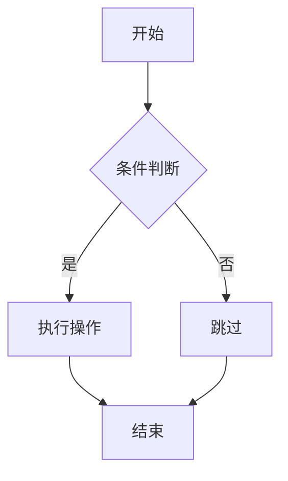
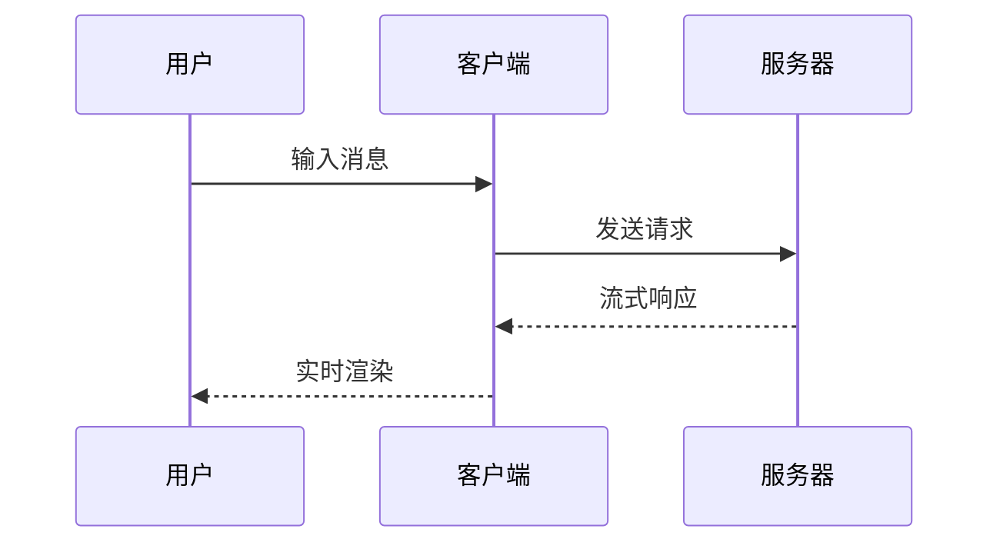

# 🚀 Incremark SolidJS 示例

欢迎使用 **Incremark**！这是一个专为 AI 流式输出设计的增量 Markdown 解析器。

## 📋 功能特点

Incremark 提供了丰富的功能来支持 AI 流式输出场景：

- ⚡ **增量解析** - 只解析新增内容，节省 90% 以上的 CPU 开销
- 🔄 **流式友好** - 支持逐字符/逐行输入，实时渲染
- 🎯 **边界检测** - 智能识别块边界，确保解析准确性
- 🔌 **框架支持** - 提供 Vue 3、React、Svelte 5 集成
- 📊 **DevTools** - 内置开发者工具，方便调试
- 🎨 **可定制** - 支持自定义渲染组件、容器和代码块
- 📐 **扩展支持** - GFM、数学公式、Mermaid 图表等
- ⌨️ **打字机效果** - 支持逐字符显示动画
- 🎭 **主题系统** - 支持默认、暗色和自定义主题
- 📜 **脚注支持** - 完整的脚注引用和定义功能
- 🔗 **HTML 支持** - 可选的 HTML 元素解析
- 📦 **自定义容器** - 支持警告、提示、信息等自定义容器
- 💻 **自定义代码块** - 支持 ECharts、Mermaid 等自定义代码块渲染

## 📐 数学公式

Incremark 支持 LaTeX 数学公式，包括行内公式和块级公式。

行内公式：质能方程 $E = mc^2$ 是物理学中最著名的公式之一。

块级公式 - 欧拉公式：

$$
e^{i\pi} + 1 = 0
$$

二次方程的求根公式：

$$
x = \frac{-b \pm \sqrt{b^2 - 4ac}}{2a}
$$

## 📊 Mermaid 图表

Incremark 内置支持 Mermaid 图表渲染，支持流程图、时序图等多种图表类型。

### 流程图



### 时序图



## 📝 GFM 功能

Incremark 支持 GitHub Flavored Markdown (GFM) 的所有功能。

### 表格

| 功能 | 状态 | 说明 |
|------|------|------|
| 增量解析 | ✅ | 核心功能 |
| Mermaid 图表 | ✅ | 内置支持 |
| 数学公式 | ✅ | LaTeX 支持 |
| 自定义容器 | ✅ | 完全支持 |
| 自定义代码块 | ✅ | 完全支持 |

### 任务列表

- [x] 核心解析器
- [x] Vue 3 集成
- [x] SolidJS 集成
- [x] Svelte 5 集成
- [x] Mermaid 图表
- [x] LaTeX 公式
- [x] 自定义容器
- [x] 自定义代码块
- [x] 打字机效果
- [x] 主题系统

### 删除线

这是~~被删除的文本~~，这是正常文本。

## 🎨 自定义容器

Incremark 支持使用 `::: container` 语法创建自定义容器。以下是一些示例：

:::warning
这是一个**警告**容器。用于向用户突出显示重要的警告或注意事项。
:::

:::info{title="信息提示"}
这是一个带自定义标题的**信息**容器。非常适合提供额外的上下文或解释说明。
:::

:::tip
这是一个**提示**容器。非常适合分享有用的提示和最佳实践！
:::

容器还可以包含多个段落和其他 Markdown 元素：

:::info{title="多段落示例"}
这是容器中的第一段。

这是第二段。你可以包含：

- 列表
- **粗体文本**
- *斜体文本*
- 甚至 `行内代码`

所有这些都可以在同一个容器中！
:::

### 如何自定义容器组件

在 SolidJS 中，你可以创建自定义容器组件并传递给 `Incremark`：

```tsx
import { useIncremark, Incremark } from '@incremark/solid'
import { CustomWarningContainer } from './CustomWarningContainer'
import { CustomInfoContainer } from './CustomInfoContainer'
import { CustomTipContainer } from './CustomTipContainer'

function App() {
  const incremark = useIncremark({ 
    gfm: true,
    containers: true  // 启用容器支持
  })

  // 定义自定义容器映射
  const customContainers = {
    warning: CustomWarningContainer,
    info: CustomInfoContainer,
    tip: CustomTipContainer,
  }

  return (
    <Incremark 
      incremark={incremark}
      customContainers={customContainers}
    />
  )
}
```

自定义容器组件接收 `name` 和 `options` props，并使用 `children` 渲染内容：

```tsx
// CustomWarningContainer.tsx
import SolidJS from 'react'

export interface CustomWarningContainerProps {
  name: string
  options?: Record<string, any>
  children?: React.ReactNode
}

export const CustomWarningContainer: React.FC<CustomWarningContainerProps> = ({ 
  options, 
  children 
}) => {
  return (
    <div className="custom-warning-container">
      <div className="custom-warning-header">
        <span className="custom-warning-icon">⚠️</span>
        <span className="custom-warning-title">
          {options?.title || '警告'}
        </span>
      </div>
      <div className="custom-warning-content">
        {children}
      </div>
    </div>
  )
}
```

## 📊 自定义代码块

Incremark 支持自定义代码块渲染组件。例如，可以为 `echarts` 语言配置自定义渲染：

```echarts
{
  "title": {
    "text": "示例图表"
  },
  "xAxis": {
    "type": "category",
    "data": ["Mon", "Tue", "Wed", "Thu", "Fri", "Sat", "Sun"]
  },
  "yAxis": {
    "type": "value"
  },
  "series": [{
    "data": [120, 200, 150, 80, 70, 110, 130],
    "type": "bar"
  }]
}
```

### 如何自定义代码块组件

在 SolidJS 中，你可以创建自定义代码块组件并传递给 `Incremark`：

```tsx
import { useIncremark, Incremark } from '@incremark/solid'
import { CustomEchartCodeBlock } from './CustomEchartCodeBlock'

function App() {
  const incremark = useIncremark({ gfm: true })

  // 定义自定义代码块映射
  const customCodeBlocks = {
    echarts: CustomEchartCodeBlock,
  }

  return (
    <Incremark 
      incremark={incremark}
      customCodeBlocks={customCodeBlocks}
    />
  )
}
```

自定义代码块组件接收 `codeStr` 和 `lang` props：

```tsx
// CustomEchartCodeBlock.tsx
import SolidJS, { useEffect, useRef, useState } from 'react'
import * as echarts from 'echarts'

export interface CustomEchartCodeBlockProps {
  codeStr: string
  lang?: string
}

export const CustomEchartCodeBlock: React.FC<CustomEchartCodeBlockProps> = ({ 
  codeStr 
}) => {
  const chartRef = useRef<HTMLDivElement>(null)
  const [error, setError] = useState('')
  const [loading, setLoading] = useState(false)

  useEffect(() => {
    if (!codeStr) return

    setError('')
    setLoading(true)

    try {
      const option = JSON.parse(codeStr)
      if (!chartRef.current) {
        setLoading(false)
        return
      }

      const chart = echarts.getInstanceByDom(chartRef.current)
      if (chart) {
        chart.setOption(option)
      } else {
        const newChart = echarts.init(chartRef.current)
        newChart.setOption(option)
      }
    } catch (e: any) {
      setError(e.message || '渲染失败')
    } finally {
      setLoading(false)
    }
  }, [codeStr])

  return (
    <div className="custom-echart-code-block">
      <div className="echart-header">
        <span className="language">ECHART</span>
      </div>
      <div className="echart-content">
        {loading ? (
          <div className="echart-loading">加载中...</div>
        ) : error ? (
          <div className="echart-error">{error}</div>
        ) : (
          <div ref={chartRef} className="echart-chart" style={{ width: '100%', height: '400px' }}></div>
        )}
      </div>
    </div>
  )
}
```

## 🔗 HTML 支持

当启用 `htmlTree` 选项时，Incremark 可以解析和渲染 HTML 元素。以下是一些 HTML 片段示例：

<div style="background: #f0f9ff; padding: 1rem; border-radius: 6px; border-left: 4px solid #3b82f6; margin: 1em 0;">
  <p style="margin: 0; color: #1e40af;"><strong>HTML 元素示例</strong></p>
  <p style="margin: 0.5em 0 0 0; color: #1e40af;">这是一个使用 HTML 样式自定义的段落。</p>
</div>

<details style="margin: 1em 0;">
  <summary style="cursor: pointer; font-weight: 600; padding: 0.5rem; background: #f3f4f6; border-radius: 4px;">点击展开详情</summary>
  <div style="padding: 1rem; background: #f9fafb; border-radius: 4px; margin-top: 0.5rem;">
    <p style="margin: 0;">这是详情内容。HTML 支持让你可以创建更丰富的交互式内容。</p>
  </div>
</details>

## 💻 代码高亮

Incremark 使用 Shiki 进行代码高亮，支持多种编程语言：

```typescript
import { useIncremark, Incremark } from '@incremark/solid'

function App() {
  const incremark = useIncremark({
    gfm: true,
    containers: true,
    htmlTree: true,  // 启用 HTML 支持
  })

  const customContainers = {
    warning: CustomWarningContainer,
    info: CustomInfoContainer,
    tip: CustomTipContainer,
  }

  const customCodeBlocks = {
    echarts: CustomEchartCodeBlock,
  }

  return (
    <Incremark 
      incremark={incremark}
      customContainers={customContainers}
      customCodeBlocks={customCodeBlocks}
    />
  )
}
```

## ⌨️ 打字机效果

Incremark 内置打字机效果支持，可以逐字符显示内容：

- **逐字符显示**：控制每次显示的字符数
- **速度可调**：调节 tick 间隔实现不同速度
- **跳过功能**：随时跳过动画显示全部内容
- **插件系统**：代码块、图片等可整体显示

## 📊 性能对比

Incremark 的增量解析策略带来了显著的性能提升：

| 指标 | 传统方式 | Incremark | 提升 |
|------|----------|-----------|------|
| 解析量 | ~50万字符 | ~5万字符 | 90% ↓ |
| CPU 占用 | 高 | 低 | 80% ↓ |
| 渲染帧率 | 卡顿 | 流畅 | ✅ |

## 📝 引用示例

> 💡 **提示**：Incremark 的核心优势是**解析层增量化**，而非仅仅是渲染层优化。
> 
> 这意味着即使内容很长，解析性能也能保持稳定。

## 🔗 链接和图片

这是一个[链接示例](https://www.incremark.com/)，指向 Incremark 官网。

## 📜 脚注支持

Incremark 支持完整的脚注功能[^1]，包括脚注引用和定义。

[^1]: 这是脚注的内容。脚注可以包含任何 Markdown 内容，包括**粗体**、*斜体*和`代码`。

## 💡 更多功能

- **自动滚动**：内容更新时自动滚动到底部
- **块状态显示**：可视化显示待处理和已完成的块
- **流式输入**：支持逐字符或逐块输入
- **类型安全**：完整的 TypeScript 类型定义

**感谢使用 Incremark！** 🙏
