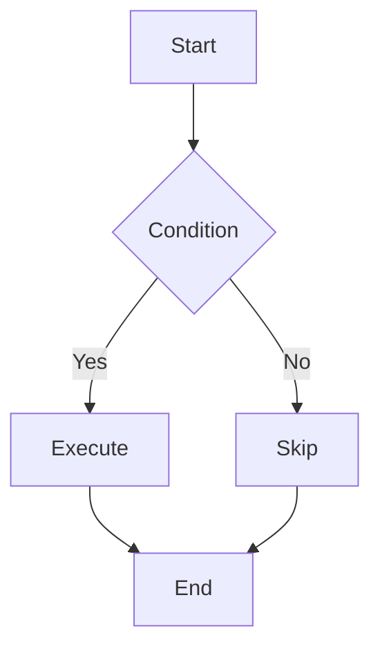
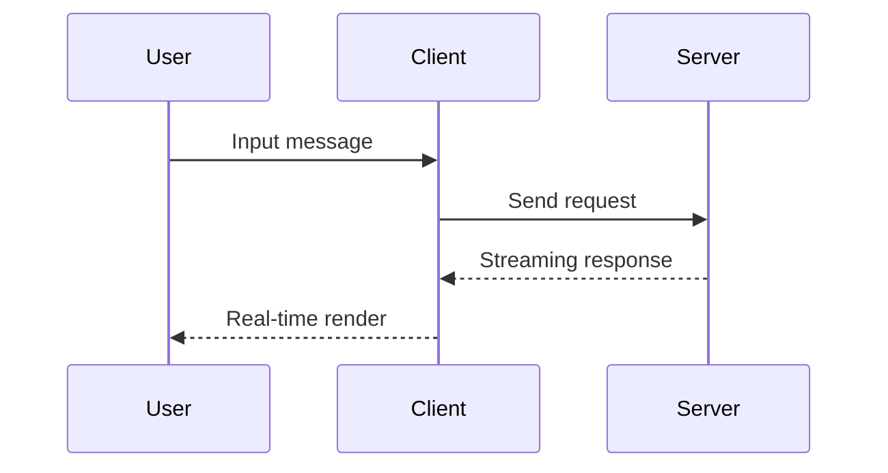

# 🚀 Incremark Svelte Example

Welcome to **Incremark**! An incremental Markdown parser designed for AI streaming output.

## 📋 Features

Incremark provides rich features to support AI streaming output scenarios:

- ⚡ **Incremental Parsing** - Only parse new content, saving 90%+ CPU overhead
- 🔄 **Streaming Friendly** - Support char-by-char/line-by-line input with real-time rendering
- 🎯 **Boundary Detection** - Smart block boundary recognition for accurate parsing
- 🔌 **Framework Support** - Vue 3, React, and Svelte 5 integrations available
- 📊 **DevTools** - Built-in developer tools for debugging
- 🎨 **Customizable** - Support for custom render components, containers, and code blocks
- 📐 **Extension Support** - GFM, math formulas, Mermaid charts, and more
- ⌨️ **Typewriter Effect** - Character-by-character display animation
- 🎭 **Theme System** - Support for default, dark, and custom themes
- 📜 **Footnote Support** - Complete footnote reference and definition functionality
- 🔗 **HTML Support** - Optional HTML element parsing
- 📦 **Custom Containers** - Support for warning, tip, info, and other custom containers
- 💻 **Custom Code Blocks** - Support for ECharts, Mermaid, and other custom code block rendering

## 📐 Math Formulas

Incremark supports LaTeX math formulas, including inline and block formulas.

Inline formula: The mass-energy equation $E = mc^2$ is one of the most famous formulas in physics.

Block formula - Euler's formula:

$$
e^{i\pi} + 1 = 0
$$

Quadratic formula:

$$
x = \frac{-b \pm \sqrt{b^2 - 4ac}}{2a}
$$

## 📊 Mermaid Charts

Incremark has built-in support for Mermaid chart rendering, supporting flowcharts, sequence diagrams, and more.

### Flowchart



### Sequence Diagram



## 📝 GFM Features

Incremark supports all GitHub Flavored Markdown (GFM) features.

### Tables

| Feature | Status | Description |
|---------|--------|-------------|
| Incremental Parsing | ✅ | Core feature |
| Mermaid Charts | ✅ | Built-in support |
| Math Formulas | ✅ | LaTeX support |
| Custom Containers | ✅ | Fully supported |
| Custom Code Blocks | ✅ | Fully supported |

### Task Lists

- [x] Core parser
- [x] Vue 3 integration
- [x] React integration
- [x] Svelte 5 integration
- [x] Mermaid charts
- [x] LaTeX formulas
- [x] Custom containers
- [x] Custom code blocks
- [x] Typewriter effect
- [x] Theme system

### Strikethrough

This is ~~deleted text~~, and this is normal text.

## 🎨 Custom Containers

Incremark supports custom containers using the `::: container` syntax. Here are some examples:

:::warning
This is a **warning** container. Use it to highlight important warnings or cautions to users.
:::

:::info{title="Information"}
This is an **info** container with a custom title. Perfect for providing additional context or explanations.
:::

:::tip
This is a **tip** container. Great for sharing useful tips and best practices!
:::

Containers can also include multiple paragraphs and other Markdown elements:

:::info{title="Multi-paragraph Example"}
This is the first paragraph in the container.

This is the second paragraph. You can include:

- Lists
- **Bold text**
- *Italic text*
- Even `inline code`

All of these can be in the same container!
:::

### How to Create Custom Container Components

In Svelte, you can create custom container components and pass them to `Incremark`:

```svelte
<script lang="ts">
  import { useIncremark, Incremark } from '@incremark/svelte'
  import CustomWarningContainer from './CustomWarningContainer.svelte'
  import CustomInfoContainer from './CustomInfoContainer.svelte'
  import CustomTipContainer from './CustomTipContainer.svelte'

  const incremark = useIncremark({ 
    gfm: true,
    containers: true  // Enable container support
  })

  // Define custom container mapping
  const customContainers = {
    warning: CustomWarningContainer,
    info: CustomInfoContainer,
    tip: CustomTipContainer,
  }
</script>

<Incremark 
  {incremark}
  {customContainers}
/>
```

Custom container components receive `name` and `options` props, and use `slot` to render content:

```svelte
<!-- CustomWarningContainer.svelte -->
<script lang="ts">
  import type { Snippet } from 'svelte';
  interface Props {
    name: string
    options?: Record<string, any>
    children?: Snippet;
  }

  let { options, children }: Props = $props()
</script>

<div class="custom-warning-container">
  <div class="custom-warning-header">
    <span class="custom-warning-icon">⚠️</span>
    <span class="custom-warning-title">
      {options?.title || 'Warning'}
    </span>
  </div>
  <div class="custom-warning-content">
    {#if children}
      {@render children()}
    {/if}
  </div>
</div>

```

## 📊 Custom Code Blocks

Incremark supports custom code block rendering components. For example, you can configure custom rendering for the `echarts` language:

```echarts
{
  "title": {
    "text": "Example Chart"
  },
  "xAxis": {
    "type": "category",
    "data": ["Mon", "Tue", "Wed", "Thu", "Fri", "Sat", "Sun"]
  },
  "yAxis": {
    "type": "value"
  },
  "series": [{
    "data": [120, 200, 150, 80, 70, 110, 130],
    "type": "bar"
  }]
}
```

### How to Create Custom Code Block Components

In Svelte, you can create custom code block components and pass them to `Incremark`:

```svelte
<script lang="ts">
  import { useIncremark, Incremark } from '@incremark/svelte'
  import CustomEchartCodeBlock from './CustomEchartCodeBlock.svelte'

  const incremark = useIncremark({ gfm: true })

  // Define custom code block mapping
  const customCodeBlocks = {
    echarts: CustomEchartCodeBlock,
  }
</script>

<Incremark 
  {incremark}
  {customCodeBlocks}
/>
```

Custom code block components receive `codeStr` and `lang` props:

```svelte
<!-- CustomEchartCodeBlock.svelte -->
<script lang="ts">
  import * as echarts from 'echarts'

  interface Props {
    codeStr: string
    lang?: string
  }

  let { codeStr }: Props = $props()

  let chartRef: HTMLDivElement | undefined = $state();
  let error = $state('')
  let loading = $state(false)

  async function renderChart() {
    if (!codeStr) return

    error = ''
    loading = true

    try {
      let option: any
      try {
        option = JSON.parse(codeStr)
        console.log(option)
      } catch (e) {
        error = 'ECharts options must be validate JSON content.'
        loading = false
        return
      }

      if (!chartRef) {
        loading = false
        return
      }

      const chart = echarts.getInstanceByDom(chartRef)
      if (chart) {
        chart.setOption(option)
      } else {
        const newChart = echarts.init(chartRef)
        newChart.setOption(option)
      }
    } catch (e: any) {
      error = e.message || 'Render Error'
    } finally {
      loading = false
    }
  }

  $effect(() => {
    renderChart()
  })
</script>

<div class="custom-echart-code-block">
  <div class="echart-header">
    <span class="language">ECHART</span>
  </div>
  <div class="echart-content">
    {#if loading}
      <div class="echart-loading">Loading...</div>
    {:else if error}
      <div class="echart-error">{error}</div>
    {:else}
      <div bind:this={chartRef} class="echart-chart" style="width: 100%; height: 400px;"></div>
    {/if}
  </div>
</div>
```

## 🔗 HTML Support

When the `htmlTree` option is enabled, Incremark can parse and render HTML elements. Here are some HTML fragment examples:

<div style="background: #f0f9ff; padding: 1rem; border-radius: 6px; border-left: 4px solid #3b82f6; margin: 1em 0;">
  <p style="margin: 0; color: #1e40af;"><strong>HTML Element Example</strong></p>
  <p style="margin: 0.5em 0 0 0; color: #1e40af;">This is a paragraph with custom HTML styling.</p>
</div>

<details style="margin: 1em 0;">
  <summary style="cursor: pointer; font-weight: 600; padding: 0.5rem; background: #f3f4f6; border-radius: 4px;">Click to expand details</summary>
  <div style="padding: 1rem; background: #f9fafb; border-radius: 4px; margin-top: 0.5rem;">
    <p style="margin: 0;">This is the detail content. HTML support allows you to create richer interactive content.</p>
  </div>
</details>

## 💻 Code Highlighting

Incremark uses Shiki for code highlighting, supporting multiple programming languages:

```typescript
import { useIncremark, Incremark } from '@incremark/svelte'
import { math } from 'micromark-extension-math'
import { mathFromMarkdown } from 'mdast-util-math'

const incremark = useIncremark({
  gfm: true,
  containers: true,
  htmlTree: true,  // Enable HTML support
  extensions: [math()],
  mdastExtensions: [mathFromMarkdown()]
})

const customContainers = {
  warning: CustomWarningContainer,
  info: CustomInfoContainer,
  tip: CustomTipContainer,
}

const customCodeBlocks = {
  echarts: CustomEchartCodeBlock,
}
</script>

<Incremark 
  {incremark}
  {customContainers}
  {customCodeBlocks}
/>
```

## 📊 Performance Comparison

Incremark's incremental parsing strategy brings significant performance improvements:

| Metric | Traditional | Incremark | Improvement |
|--------|-------------|-----------|-------------|
| Parse Volume | ~500K chars | ~50K chars | 90% ↓ |
| CPU Usage | High | Low | 80% ↓ |
| Frame Rate | Laggy | Smooth | ✅ |

## 📝 Blockquote Example

> 💡 **Tip**: Incremark's core advantage is **parsing-level incrementalization**, not just render-level optimization.
> 
> This means parsing performance remains stable even with very long content.

## 🔗 Links and Images

This is a [link example](https://www.incremark.com/) pointing to the Incremark website.

## 📜 Footnote Support

Incremark supports complete footnote functionality[^1], including footnote references and definitions.

[^1]: This is the footnote content. Footnotes can contain any Markdown content, including **bold**, *italic*, and `code`.

## 💡 More Features

- **Auto Scroll**: Automatically scroll to bottom when content updates
- **Block Status Display**: Visualize pending and completed blocks
- **Streaming Input**: Support char-by-char or block-by-block input
- **Type Safety**: Complete TypeScript type definitions

**Thanks for using Incremark!** 🙏
